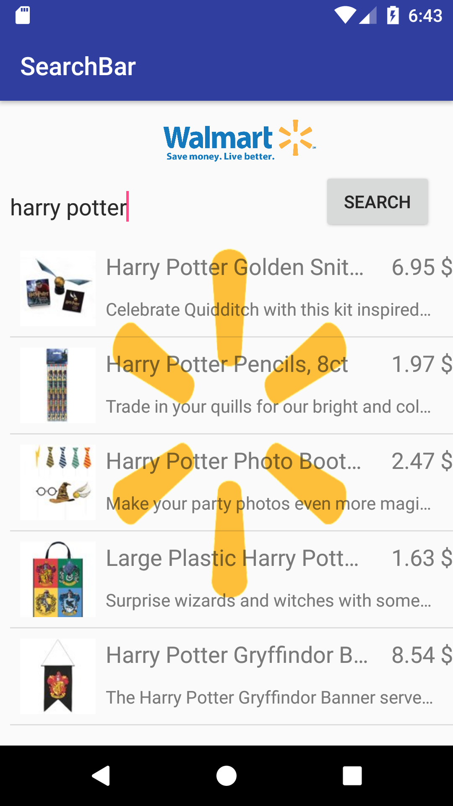
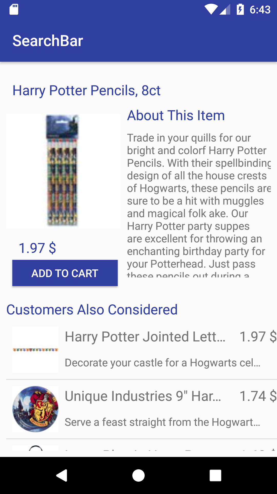
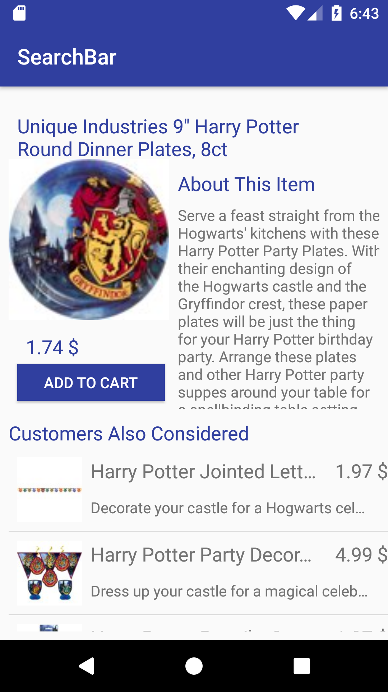

# **SearchBarWalmart**

**Develop a native android application to display Walmart product search results and rank-ordered recommendations.**

## Introdction

- _This is an android application which allows you to search for products in the huge database of Walmart search API and get a list of all the related products to your search._

- _It lets you view the search results and view the short description of every product in a ListView._

- _You can click on any one of the products and view them in another activity with long description and enlarged image._

- _This app also lets you view the recommended products, and view and open them._

- _It has a dummy "add to cart" button to enhance the look of the app._

- _It has advanced keyboard management features like "Start the search on hitting ENTER from keyboard"._

- _It has a ditto look of how Walmart color pallette looks._

## Links and screenshots
[Here](https://drive.google.com/open?id=1TkXArptWCQGkRaKiVPJSP-InNE_AKsFd) is a link to a working demo of the app.

Here are the screenshots of how the app looks!

## Prerequisites
Latest version of Android Studio

## Features
- **Main Activity** : This activity lets you enter a product name in a _searchEditText_ and click on the _Search_ Button to get the search results.

- **Walmart API key** : You can register for an API key from Walmart open API documentation, [here](https://developer.walmartlabs.com/)

- **Search button in Main Activity** : Once you click on the search button, you can view a list of products that is extracted from the lookup API using JSON objects and parsing JSON data.

- **Keyboard management** : You can tap on the ENTER key in your keyboard to start searching.

- **ListView of search products** : A list of search products is displayed with title, thumbnail, short description and price of the product. You can click on the product and you will be redirected to the next activity that is recommendation activity.

- **Recommendation Activity** : Once you click on a product in main activity, a large display of product details will be shown in this activity. You can see an _enlarged image of the product, long description(scrollable), price and title._

- **Recommended products** : You can see a "Customers also bought" tag in this activity, below which all the recommended products are displayed. This is done by accessing the recommendation API of Walmart. You can click on anyone of the items and that item will be displayed with details and recommended product list.

- **Item class** : This class is created to have all the getters and setters for the item details.

- **ItemAdapter class** : Adapter view for the product list.

- **Layouts** : You can see a basic walmart logo on the main activity display with a search bar and a search button. In the next screen, you can see an enlarged _imageView_ of the product image, _long description_ of the product, _price_ and _title_. There is a listView below where you can see recommended products. There is a dummy _add to cart_ button.

## Import this project

- Step 1: Download Zip. 

- Step 2: Open Android Studio->New Project->Open->Select android directory.

- Step 3: Android Studio tells you this is a eclipse project (Convert it to gradle blah blah). Hit Next. 

- Step 4: Done.

## Future scope

- Add to cart options can be added.

- Login, signup portal can be implemented.

- Links to payment methods can be added.

- Ads can be shown, deals can flash on the main activity.

- Reviews can be put up.

